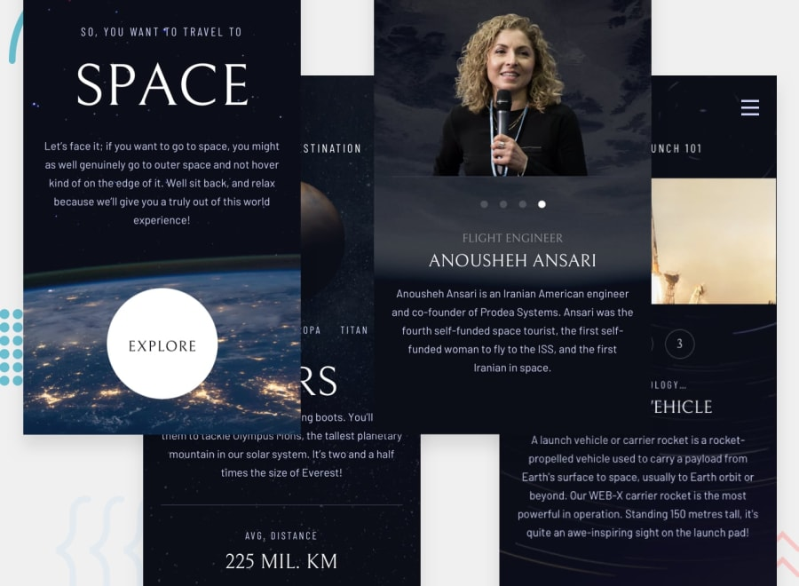

# Frontend Mentor - Space tourism website solution

This is a solution to the [Space tourism website challenge on Frontend Mentor](https://www.frontendmentor.io/challenges/space-tourism-multipage-website-gRWj1URZ3). Frontend Mentor challenges help you improve your coding skills by building realistic projects. 

## Table of contents

- [Frontend Mentor - Space tourism website solution](#frontend-mentor---space-tourism-website-solution)
  - [Table of contents](#table-of-contents)
  - [Overview](#overview)
    - [The challenge](#the-challenge)
    - [Screenshot](#screenshot)
    - [Links](#links)
  - [My process](#my-process)
    - [Built with](#built-with)
    - [What I learned](#what-i-learned)
  - [Author](#author)

## Overview

### The challenge

Users should be able to:

- View the optimal layout for each of the website's pages depending on their device's screen size
- See hover states for all interactive elements on the page
- View each page and be able to toggle between the tabs to see new information

### Screenshot

Add a screenshot of your solution. The easiest way to do this is to use Firefox to view your project, right-click the page and select "Take a Screenshot". You can choose either a full-height screenshot or a cropped one based on how long the page is. If it's very long, it might be best to crop it.

### Links

- GitHub: [SpaceTourism_Challenge](https://github.com/Arthur-Ferreira/SpaceTourism_Challenge)
- Live Site URL: [Add live site URL here](https://your-live-site-url.com)

## My process

### Built with

- Semantic HTML5 markup
- CSS custom properties
- Flexbox
- Mobile-first workflow
- [React](https://reactjs.org/) - JS library
- [React Router](https://reactrouter.com/en/main) - React framework
- [Typescript](https://www.typescriptlang.org/) - Javascript superset
- [Redux Toolkit](https://redux-toolkit.js.org/) - Javascript framework
- [ESLint](https://eslint.org/) - Javascript framework
- [Prettier](https://prettier.io/) - Code formatter
- [Styled Components](https://styled-components.com/) - For styles

### What I learned

The application leverages React and Redux technologies to create an engaging space tourism experience, allowing users to explore the cosmos virtually and learn about the wonders of space:
 - Redux, a predictable state container for JavaScript apps, is employed to manage the application's state effectively. By centralizing the state and actions within the Redux store, the application ensures data consistency and facilitates state updates across different components, enhancing maintainability and scalability.
 - With React Router's declarative routing approach, the application maintains clean and intuitive navigation paths, enhancing user experience and usability.
 - TypeScript, a statically typed superset of JavaScript, is employed to enhance code reliability and maintainability. By providing static type checking and interfaces, TypeScript helps catch errors at compile time and improves code documentation, enabling better collaboration and codebase understanding.
 - CSS Modules are utilized for styling components, providing scoped and modular CSS encapsulation. By encapsulating styles within component-specific CSS modules, the application ensures style isolation and avoids CSS class naming conflicts, enhancing maintainability and scalability of the styling codebase.

## Author

- Website - [Arthur Ferreira](https://arthurferreiradev.netlify.app/)
- Frontend Mentor - [@Arthur-Ferreira](https://www.frontendmentor.io/profile/Arthur-Ferreira)
- LinkedIn - [in/arthurferreira-dev](https://www.linkedin.com/in/arthurferreira-dev/)
